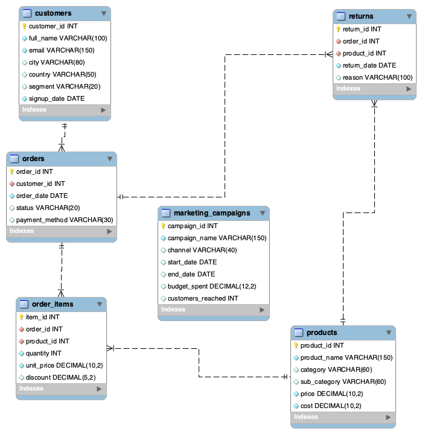

# ShopSmart SQL Analytics

A self-designed 6-table MySQL e-commerce database, built to practice 
real business analytics using pure SQL — no shortcuts, no downloaded datasets.

## Database Schema

**6 tables:**
- `customers` — 50 Indian customers across 3 segments (Premium, Standard, Budget)
- `products` — 30 products across 7 categories
- `orders` — order history with status tracking
- `order_items` — bridge table for order-product relationships
- `returns` — return records with reasons
- `marketing_campaigns` — 10 campaigns across 5 channels

Full schema: [`schema/shopsmart_setup.sql`](schema/shopsmart_setup.sql)

## Analyses

### 1. RFM Customer Segmentation
**Query:** [`queries/01_rfm_segmentation.sql`](queries/01_rfm_segmentation.sql)

Segments customers by Recency, Frequency, and Monetary value using 
NTILE(5) window functions and CASE-based scoring logic.

**Key finding:** Among 19 repeat customers, Champions and Loyal segments 
(47% of customers) generate 74% of total revenue. At Risk customers 
represent ₹4.1L in recoverable revenue.

**Results:** [`results/summary_query_segment_distribution.csv`](results/summary_query_segment_distribution.csv) | [`results/ShopSmart_customer_segmentation.csv`](results/ShopSmart_customer_segmentation.csv)

**Techniques used:**
- 4 chained CTEs for readable, step-by-step logic
- NTILE(5) window function for score bucketing
- DATEDIFF for recency calculation
- CASE WHEN for business-friendly segment labels

---

### 2. Month-over-Month & Year-over-Year Growth
**Query:** [`queries/02_mom_yoy_growth.sql`](queries/02_mom_yoy_growth.sql)

Tracks monthly revenue trends using LAG window functions for MoM 
and YoY comparisons, plus a 3-month moving average and running 
total for trend smoothing.

**Key findings:**
- Annual revenue grew from ₹7.36L (2022) to ₹8.71L (2025), with 
  a dip in 2023 (-25.3%) followed by a strong recovery in 2024 (+39.9%)
- Best single month was January 2022 (₹1.35L), sitting ₹72K above 
  the overall monthly average
- Revenue is highly volatile month-to-month (swings from +2,900% 
  to -98%), driven by low monthly order volume (1-3 orders/month) — 
  revenue is order-concentrated rather than a steady stream

**Results:** [`results/monthly_growth_trends.csv`](results/monthly_growth_trends.csv) | [`results/best_month_analysis.csv`](results/best_month_analysis.csv) | [`results/declining_months.csv`](results/declining_months.csv)

**Techniques used:**
- LAG() for both 1-month (MoM) and 12-month (YoY) comparisons
- Window-based 3-month moving average (ROWS BETWEEN 2 PRECEDING AND CURRENT ROW)
- Running total via SUM() OVER()
- CASE-based trend labeling (Growth/Decline/Flat/First Month)

---

*More analyses (Cohort Analysis, Customer Retention, CLV) coming as this portfolio grows.*

## Author

Plabon Roy — BBA Business Analytics, Chandigarh University  
[LinkedIn](https://linkedin.com/in/plabon-roy-analytics) | [Kaggle](https://kaggle.com/pl9roy)
